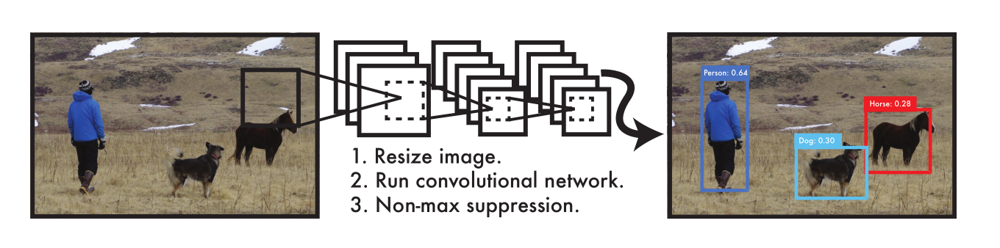
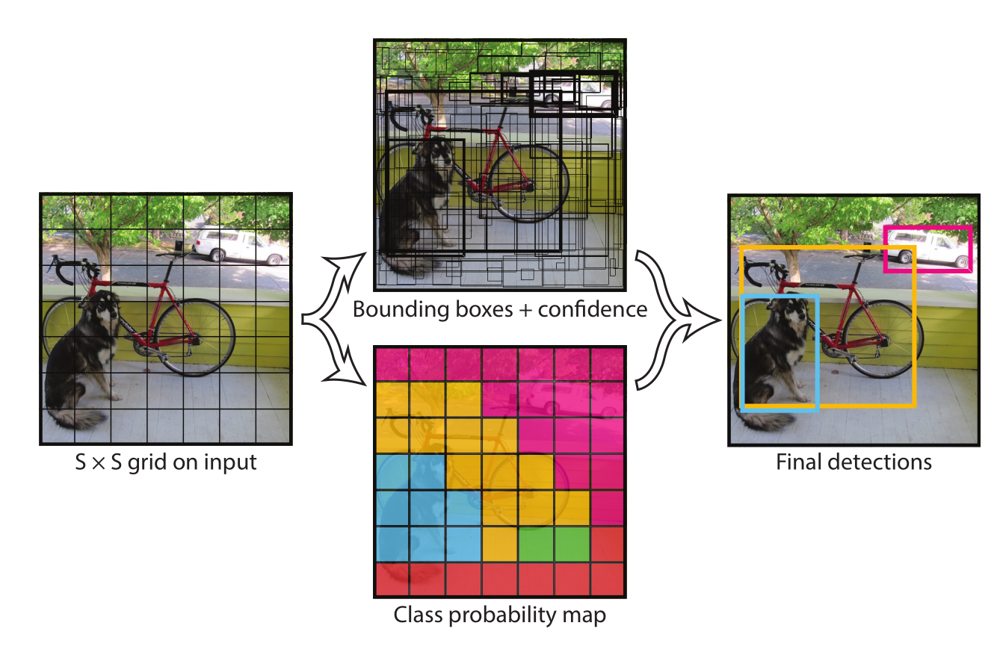
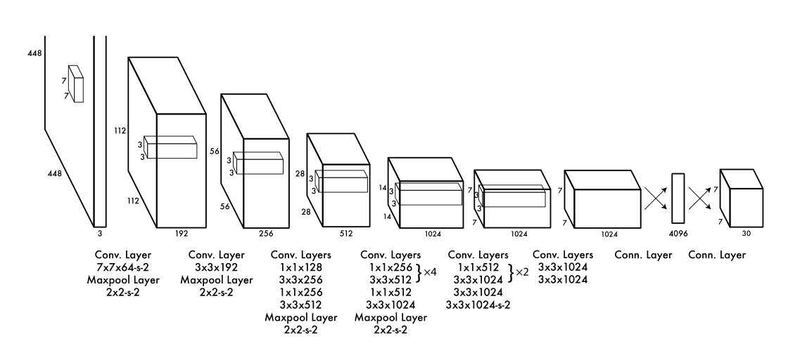
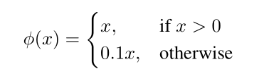
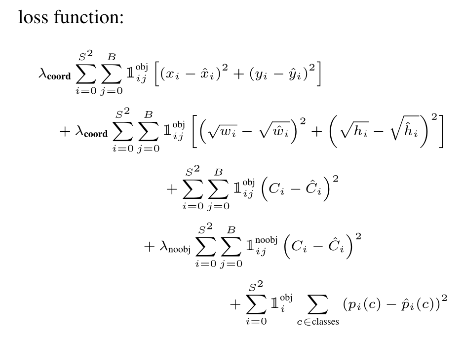

# YOLO v1

## 前言

之前的目标检测网络大多采用改造分类器来实现目标的检测，如使用滑动窗口，或者候选区域，在用另外的预测结构来进行预测。

而YOLO提出了一种one-stage的目标检测，把目标检测转换为回归问题，来预测bounding box和class probabilities。

YOLO整合了各种检测、预测单元，提出了一种统一化的系统，对原始图片直接进行检测，得到bounding box和class probabilities。这就是YOLO名字的由来，You Only Look Onece就能检测出目标。这种统一化的系统有一些优势：

* 速度很快。当把检测转换为回归问题，就会减少很多的组件和步骤。直接通过一个网络就能对图片进行操作得到结果 。
* YOLO 给出的预测有着全局上的合理性。不像滑动窗口和候选区域技术，YOLO检测完整的原始图像，经过训练和测试得到目标的bounding box和隐含的class probabilities。
* YOLO能够学习目标的通用特征。这使得YOLO有良好的泛化性。

当然，YOLO追求了实时的快速性，这也导致了它的准确率与其他state of art的目标检测算法有一定的准确率差距。

## 统一化检测

YOLO将通常目标检测的各个部分统一化成一个网络。通过网络获取完整图片的特征来预测bounding box和class probabilities。YOLO的设计了端到端的训练，较快的检测速度还有不错的准确度。

系统将输入图片分割为SxS个网格，每个网格预测B个bounding box。负责预测的网格应该是目标中心落在的那个网格。

每个bounding box给出5个预测，x、y、w、h和目标的置信度。置信度的计算为。

每个网格还会预测C个class probabilities，。**每个网格只预测以此分类概率，无论网格有多少个boxes。**

在测试的时候，将分类预测概率和目标置信度相乘：

这就是每个box的分类置信度。这个置信度同时编码了分类出现的概率和目标出现的概率。

最后得到预测的tensor为。

### 网络设计

以googlenet作为basenet，但是没有采用inception结构，而是直接用1x1和3x3卷积进行操作。使用的网络结构总共有24层卷积层+2层fc层。

同时还有一个Fast YOLO，采用更少的层数（9个conv）和更少的filters。

### 训练

通过在Imagenet的数据预训练，再在pascal voc上进行预测。

预训练的时候采用224x224的输入，目标检测的时候采用448x448的输入。

通过图像的宽和高归一化bounding box的宽和高，把x、y通过网格作为offset来进行归一化。

激活函数使用LReLU：

loss采用均方误差。选择均方误差的原因是更容易优化。**但是把位置误差和分类误差平等的优化可能不是最理想的操作**。同样，如果有的网格没有目标，那么置信度就会趋于0，让反向传播更加困难。

为了缓解这些问题，论文对不同的误差设置了权重——增加bounding box的误差权重，减少没有目标的置信度误差权重。令。

均方误差同等地反映了大box和小box的误差，而loss应该反映在较大的box中的小偏差影响更少，所以取宽度w和高度h的平方根来进行误差衡量。

在预测中，把与真实值有更高的iou的box作为负责预测的点，**每个网格最后只有一个预测**。

* 这也导致了yolo v1在预测目标密集的情况下效果不好，**无法在一个网格里预测出多个目标**。
* 因为预测bounding box，导致需要统一size的图片。当输入数据的比例不同，效果也会有不同。
* loss函数采取的均方误差，让大小box之间的误差不好衡量。

